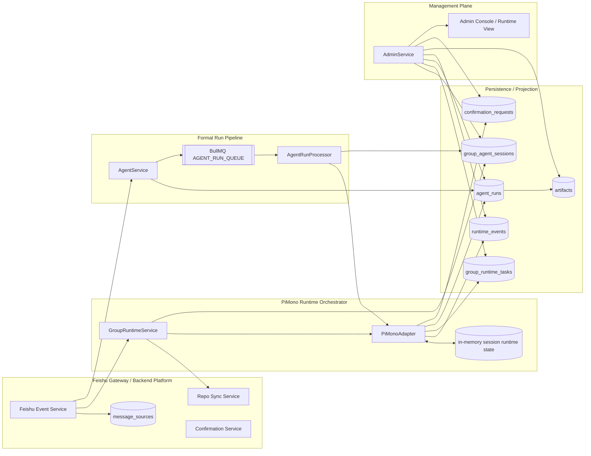
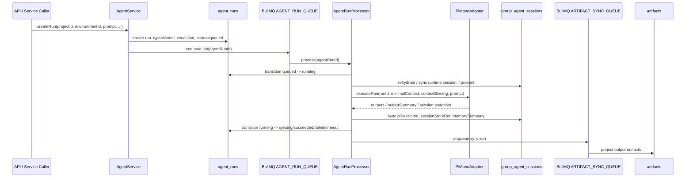
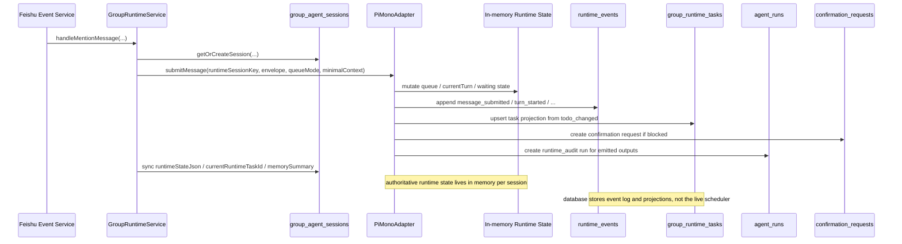
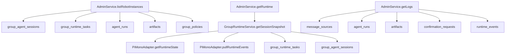

# PiMono Runtime Management Plane Architecture

更新日期：2026-04-29

## 目标

这张图说明当前 `feishu-kanban` 是如何追踪 Pi SDK 执行任务的，重点回答三个问题：

- 正式执行任务由谁创建、谁推进、谁落日志
- 群聊运行时任务由谁编排、谁持有真实状态、谁做投影
- 管理平面最终读取哪些数据源来展示运行状态

## 总览

## 两条主链路

### 1. 正式执行链路

正式执行的追踪主对象是：

- `agent_runs`
- `BullMQ AGENT_RUN_QUEUE`
- `group_agent_sessions` 中的会话恢复与摘要同步

也就是说，管理平面看正式任务时，本质上看的是“业务 run 状态机”，不是直接看 Pi SDK 内部 job 列表。

### 2. 群聊运行时链路

群聊运行时的追踪主对象是：

- `PiMonoAdapter` 的 session 内存态
- `runtime_events`
- `group_agent_sessions.runtime_state_json`
- `group_runtime_tasks` 投影
- 必要时生成的 `agent_runs(run_type=runtime_audit)`

也就是说，管理平面看群聊运行时，不是靠 `group_runtime_tasks` 驱动调度，而是靠“运行时内存态 + 持久化事件日志 + 任务投影”。

## 管理平面读取模型

当前管理平面实际展示的数据来源：

- 机器人实例列表：
  - `group_agent_sessions`
  - `group_runtime_tasks`
  - `agent_runs`
  - `artifacts`
  - `group_policies`
- 运行时详情：
  - `PiMonoAdapter.getRuntimeState(...)`
  - `PiMonoAdapter.pullRuntimeEvents(...)`
  - `group_runtime_tasks`
  - `group_agent_sessions`
- 日志页：
  - `message_sources`
  - `agent_runs`
  - `artifacts`
  - `confirmation_requests`
  - `runtime_events`

## 状态归属

建议用下面这张表理解“谁是真状态，谁是镜像”：

| 维度 | 真状态归属 | 管理平面主要读取 | 备注 |
| --- | --- | --- | --- |
| 正式执行 run | `agent_runs` + BullMQ job 生命周期 | `agent_runs` | Pi SDK 只是执行引擎 |
| 群聊 turn/queue/waiting | `PiMonoAdapter` session 内存态 | `runtime_state_json` + `runtime_events` | 数据库不是 live scheduler |
| runtime todo 列表 | `PiMonoAdapter` 内存态，经 `todo_changed` 投影 | `group_runtime_tasks` | 现在是 projection-only |
| 输出审计 | `agent_runs(run_type=runtime_audit)` | `agent_runs` / `artifacts` | 用于后台查看和审计 |
| 人工确认 | `confirmation_requests` + session waiting state | `confirmation_requests` + `runtime_events` | 阻塞与恢复都走 runtime |

## 一句话结论

当前管理平面追踪 Pi SDK 执行任务的方案是：

1. 正式执行任务使用 `agent_runs + BullMQ` 作为业务控制面。
2. 群聊运行时使用 `PiMonoAdapter` 的 per-session 内存态作为调度真相源。
3. `runtime_events`、`group_agent_sessions.runtime_state_json`、`group_runtime_tasks`、`runtime_audit agent_runs` 共同构成可观测与审计层。
4. 后台页面读取的是这些“业务侧状态与投影”，不是 Pi SDK 原生任务面板。
